1. PENJELASAN PROGRAM

Di bagian ini saya akan memberikan gambar dari blok blok kode yang saya pakai di program saya beserta penjelasan singkat per blok kodenya

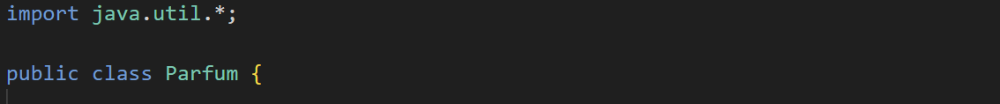

import java.util.\* digunakan untuk mengimport semua package java.util seperti arraylist, scanner, dll

Merupakan class utama bernama DataParfum yang menjadi tempat seluruh program ditulis

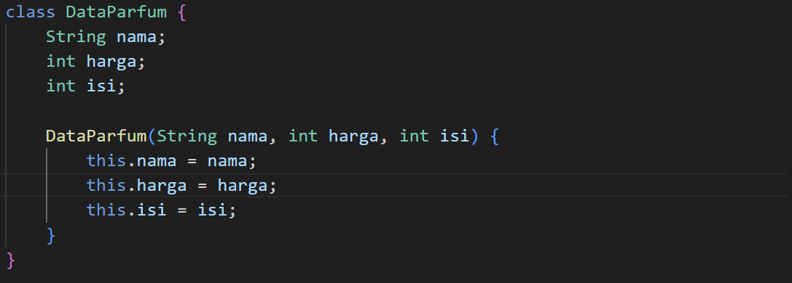

Blok ini digunakan sebagai template parfum

Setiap objek dari DataParfum memiliki 3 atribut dengan jenis tipe datanya masing masing

Terdapat constructor DataParfum dengan nama, harga, dan isi yang berfungsi untuk mengisi data saat objek dibuat

Di dalam blok constructor ini terdapat kode seperti :
this.nama = nama;

Maksudnya adalah dia mengisi atribut nama milik objeknya dengan nilai nama yang dikirim ke constructornya, jadi nilai dari parameter nama ini akan disimpan ke atribut nama

Untuk kode this.harga = harga; dan this.isi = isi; itu fungsinya sama dengan yang kode nama tadi cuma beda parameter aja

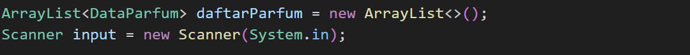

Membuat arraylist bernama daftarParfum yang fungsinya untuk menyimpan banyak data parfum

Scanner digunakan untuk menerima input dari user

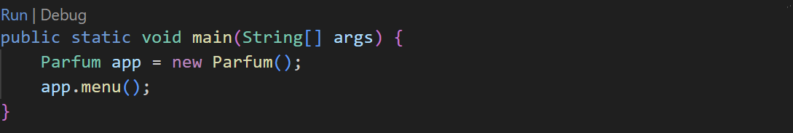

Merupakan method pertama yang dijalankan saat program dimulai

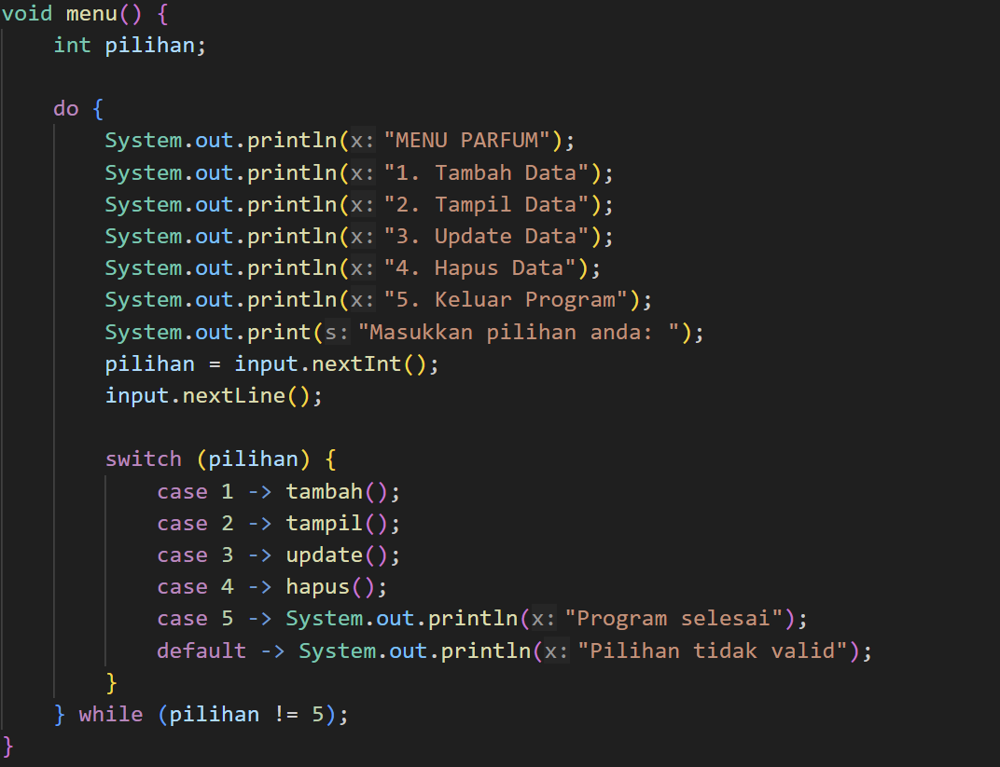

Method yang berfungsi untuk menampilkan menu utama

Dapat menyimpan angka pilihan menu dari user di variabel pilihan bertipe int, semisal user input angka 1 maka akan masuk ke case 1

Menggunakan perulangan do-while agar program terus berjalan dan halaman menu nya minimal muncul dulu sekali, program akan terus mengulang selama user tidak menginput angka 5

Jika user memilih angka 1 maka method tambah akan dijalankan

Jika user memilih angka 2 maka method tampil akan dijalankan

Jika user memilih angka 3 maka method update akan dijalankan

Jika user memilih angka 4 maka method hapus akan dijalankan

Jika user memilih angka 5 maka program akan berhenti dan menampilkan pesan Program selesai

Jika user memilih angka selain angka 1, 2, 3, 4, dan 5 maka program akan menampilkan pesan Pilihan tidak valid dan akan tetap looping

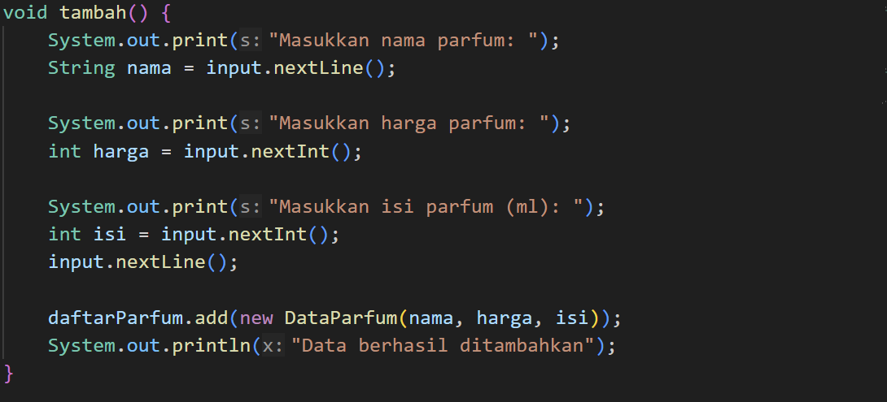

Digunakan untuk menambahkan data parfum ke DaftarParfum

Untuk menambahkan nama menggunakan string karena tipe datanya teks, input.nextLine() untuk membaca satu baris teksnya lalu menyimpan input itu ke variabel nama

Untuk harga dan isi sama saja caranya cuma beda di tipe data saja

daftarParfum.add(new DataParfum(nama, harga, isi)); bagian ini berfungsi untuk membuat objek DataParfum baru dari input user tadi lalu memasukkan objek itu ke dalam ArrayList daftarParfum

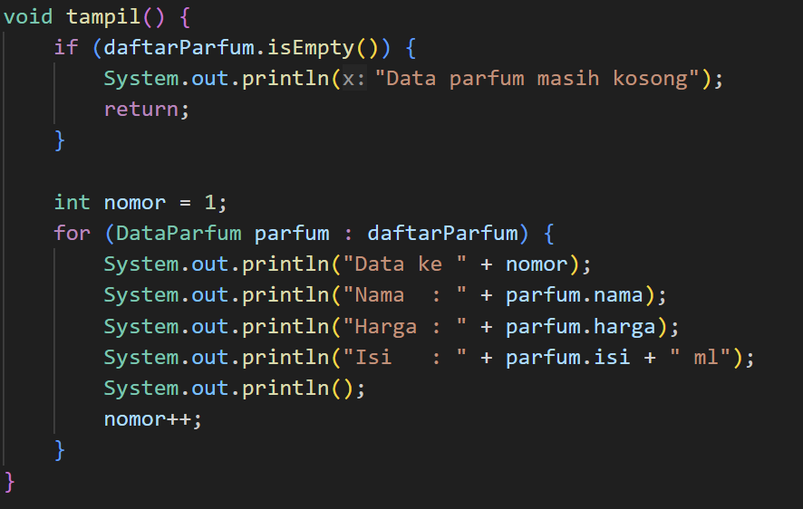

Digunakan untuk menampilkan data parfum saat ini

Sebelum menampilkan data parfum, dia akan mengecek dulu apakah datanya kosong apa tidak, kalau kosong maka akan menampilkan pesan Data parfum masih kosong

Kalau ada isinya maka dia akan membuat variabel nomor bertipe int yang hasilnya 1 cuma untuk memberi nomot urut saja pada data yang mau ditampilkan

Terdapat perulangan for each yang berfungsi untuk mengambil data satu per satu dari daftarParfum dan menambah variabel nomor sebanyak 1 setiap perulangannya selesai, misal awalnya nomor = 1, setelah parfum pertama keluar, maka 1 + 1 = 2 untuk data parfum kedua, dst

.png>)

.png>)

Berfungsi untuk mengubah data parfum yang sudah ada di ArrayList

Sebelum mengupdate data parfum, dia akan mengecek dulu apakah datanya kosong apa tidak, kalau kosong maka akan menampilkan pesan Data parfum masih kosong

Kalau ada isinya maka dia akan menampilkan dulu semua data parfum saat ini dengan method tampil()

Kemudian kita bisa memasukkan angka untuk memilih data parfum mana yang ingin kita update, dengan kondisi user tidak boleh memasukkan angka kurang dari 1 atau user memasukkan angka lebih besar dari jumlah data yang ada

Setelah semua kondisi terpenuhi, kita bisa memasukkan nama, harga, dan isi baru dan program akan menggantinya

Terdapat fungsi no sebagai nomor urut saat program melakukan perulangan data pada parfum, menggunakan for-each agar program membaca setiap objek dataParfum di dalam DaftarParfum satu per satu, kemudia di cek apakah nomor urut saat ini sama dengan nomor data yang dipilh user

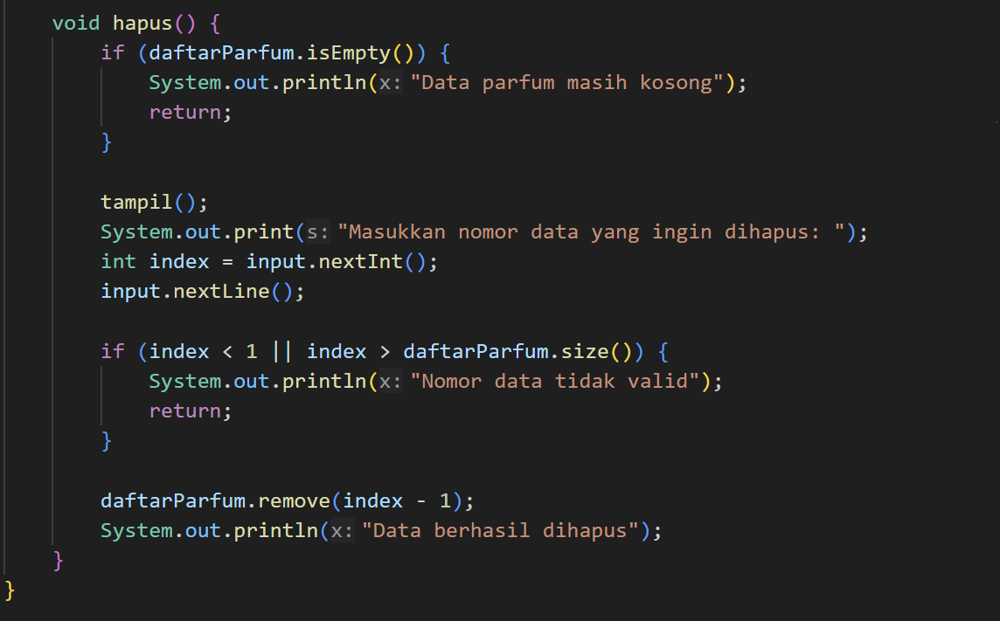

Berfungsi untuk menghapus data parfum yang sudah ada di ArrayList

Sebelum menghapus data parfum, dia akan mengecek dulu apakah datanya kosong apa tidak, kalau kosong maka akan menampilkan pesan Data parfum masih kosong

Kalau ada isinya maka dia akan menampilkan dulu semua data parfum saat ini dengan method tampil()

Kemudian kita bisa memasukkan angka untuk memilih data parfum mana yang ingin kita hapus, dengan kondisi user tidak boleh memasukkan angka kurang dari 1 atau user memasukkan angka lebih besar dari jumlah data yang ada

Setelah semua kondisi terpenuhi, maka parfum yang dipilih akan terhapus

2. HASIL OUTPUT

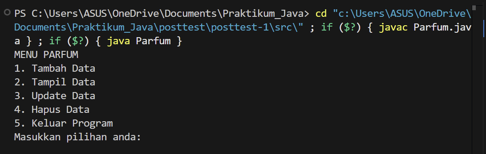

Merupakan tampilan awal saat kita memulai program

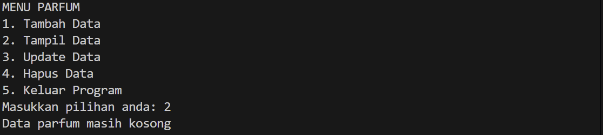

Merupakan tampilan parfum saat gak ada parfumnya

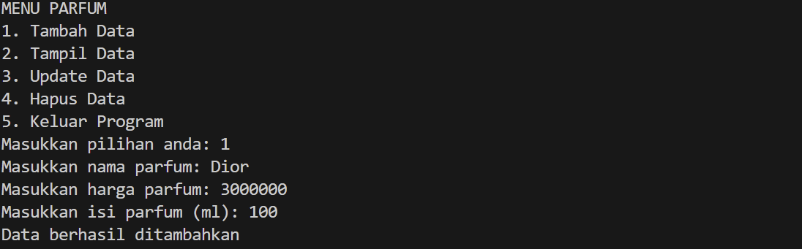

Merupakan tampilan saat kita ingin menambah data parfum pertama

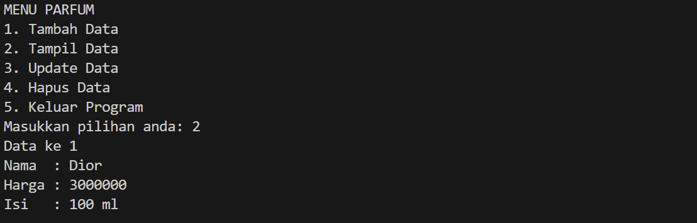

Merupakan tampilan saat kita sudah menambahkan parfum pertama

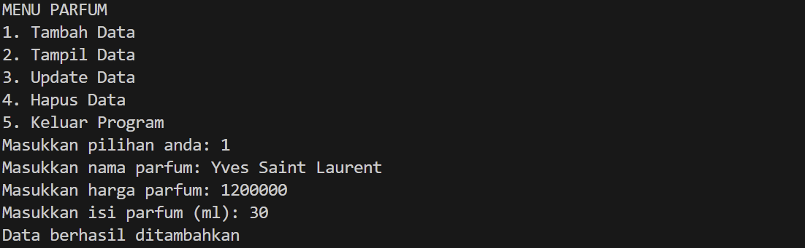

Merupakan tampilan saat kita ingin menambah data parfum kedua

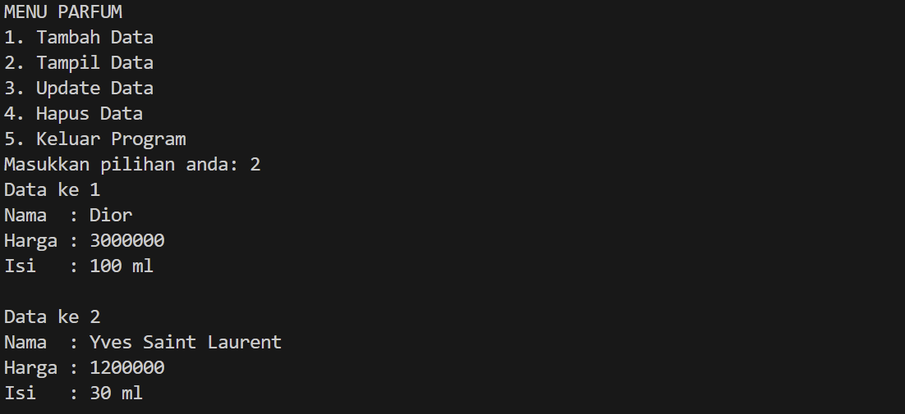

Merupakan tampilan saat kita sudah menambahkan parfum kedua

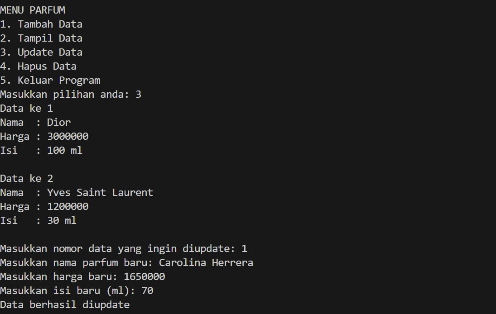

Merupakan tampilan saat kita lagi mengupdate data

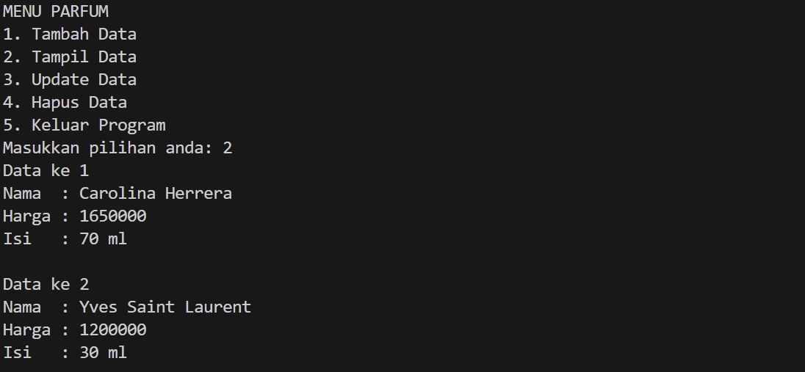

Merupakan tampilan parfum saat sudah ada yang diupdate

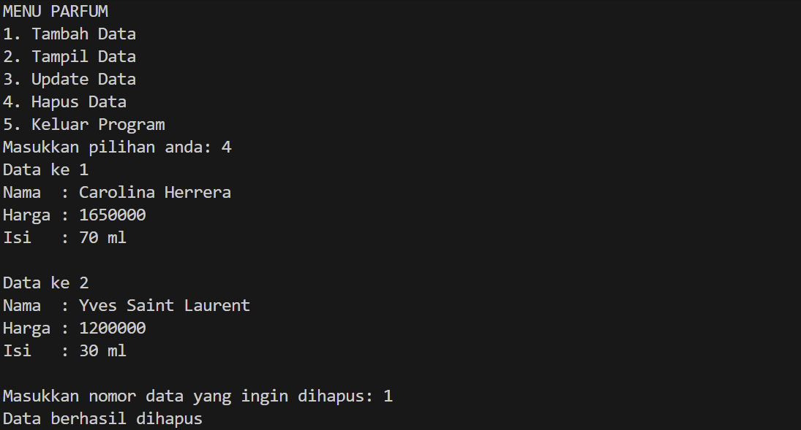

Merupakan tampilan saat kita ingin menghapus parfum

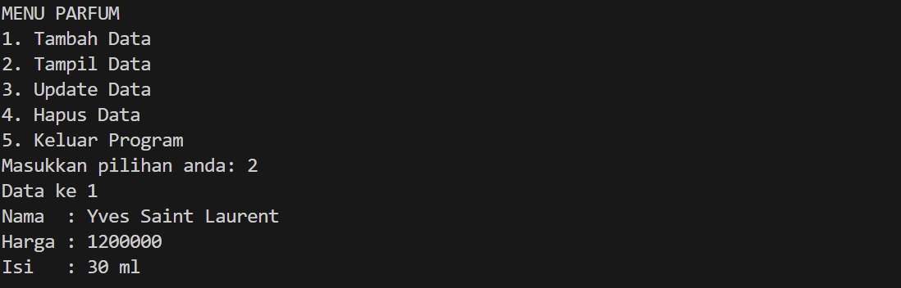

Merupakan tampilan parfum saat sudah ada parfum yang dihapus

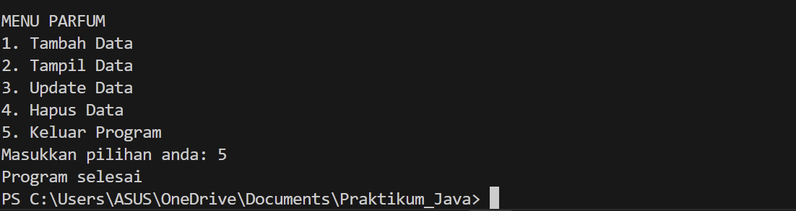

Merupakan tampilan ketika kita sudah keluar dari program
