1. PENJELASAN PROGRAM

Di bagian ini saya akan memberikan gambar dari blok blok kode yang saya pakai di program saya beserta penjelasan singkat per blok kodenya

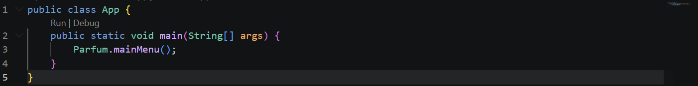

Merupakan bagian awal dari kode yang akan dijalankan, membuat kelas bernama App yang bersifat public, terdapat Parfum.mainMenu() yang memanggil method dari mainMenu() dari kelas parfum

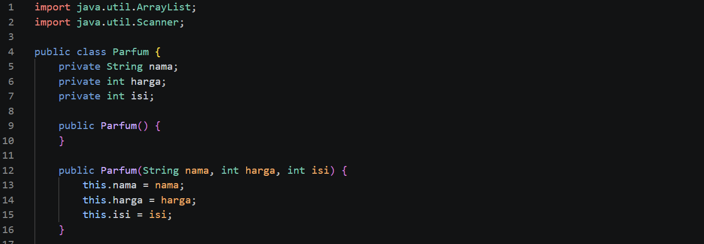

import java.util.Arraylist dan improt java.util.Scanner digunakan untuk mengimport package java.util seperti arraylist, scanner, dll

Membuat class utama parfum yang bersifat public agar bisa diakses di luar kelas

Membuat class DataParfum yang berisi atribut nama, isi, jenis dan harga yang bersifat private agar tidak bisa diakses di luar kelas

Membuat constructor kosong untuk membuat objek DataParfum tanpa langsung mengisi data

Membuat constructor dengan isi dengan parameter nama, isi, jenis, dan harga yang nanti digunakan untuk langsung isi data saat membuat objek

.png)

.png>)

Memakai method getter untuk mengambil nilai nama, isi, jenis dan harga yang semuanya bersifat public

Memakai method setter untuk untuk mengisi nilai dari nama, jenis, isi dan harga yang diisi boolean untuk mengembalikan hasil true atau false dan semuanya bersifat public

Setiap method setter memiliki kondisinya sendiri dimana untuk nama parfum tidak boleh kosong, jenis parfum tidak boleh kosong, harga parfum harus lebih dari 0, dan isi parfum harus lebih dari 0, jika kondisi terpenuhi maka akan menghasilkan nilai true

Terdapat protected void output gunanya cuma untuk menampilkan output data parfum ke layar

.png>)

.png>)

Membuat arraylist bernama daftarParfum yang fungsinya untuk menyimpan banyak data parfum

Method yang berfungsi untuk menampilkan menu utama

Dapat menyimpan angka pilihan menu dari user di variabel pilihan bertipe int, semisal user input angka 1 maka akan masuk ke case 1

Menggunakan perulangan do-while agar program terus berjalan dan halaman menu nya minimal muncul dulu sekali, program akan terus mengulang selama user tidak menginput angka 5

Jika user memilih angka 1 maka method tambah akan dijalankan

Jika user memilih angka 2 maka method tampil akan dijalankan

Jika user memilih angka 3 maka method update akan dijalankan

Jika user memilih angka 4 maka method hapus akan dijalankan

Jika user memilih angka 5 maka program akan berhenti dan menampilkan pesan Program selesai

Jika user memilih angka selain angka 1, 2, 3, 4, dan 5 maka program akan menampilkan pesan Pilihan tidak valid dan akan tetap looping

.png>)

.pngg>)

Method tambah digunakan untuk menambah parfum baru

User diminta memasukkan nama, jenis, harga, dan isi parfum, inputan dari user akan dikirim ke masing-masing setter yang berhubungan dan akan di cek melalui kondisi setternya masing-masing, jika hasilnya true maka inputan akan valid dan tersimpan

Method ini merupakan public karena method ini aman untuk dipanggil di luar class

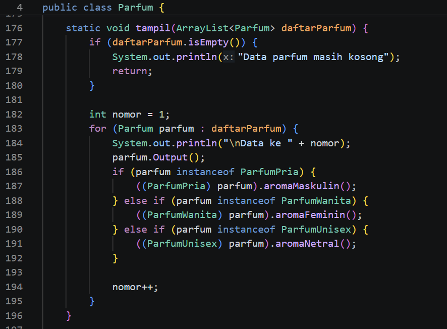

Method tampil digunakan untuk menampilkan daftar parfum saat ini

Sebelum menampilkan data parfum, dia akan mengecek dulu apakah datanya kosong apa tidak, kalau kosong maka akan menampilkan pesan Data parfum masih kosong

Kalau ada isinya maka dia akan membuat variabel nomor bertipe int yang hasilnya 1 cuma untuk memberi nomot urut saja pada data yang mau ditampilkan

Terdapat perulangan for yang berfungsi untuk mengambil data satu per satu dari daftarParfum dan menambah variabel nomor sebanyak 1 setiap perulangannya selesai, misal awalnya nomor = 1, setelah parfum pertama keluar, maka 1 + 1 = 2 untuk data parfum kedua, dst

Program melakukan pengecekan tipe objek menggunakan instancoof untuk mengetahui apakah objek tersebut merupakan ParfumPria, ParfumWanita, ParfumUnisex. Jika objek termasuk ParfumPria, maka akan dilakukan casting ke tipe ParfumPrida dan memanggil method aromaMaskulin(), begitupun dengan ParfumWanita, dan ParfumUnisex

Terakhir menampilkan hasilnya dengan mengimplementasikan konsep getter

Method ini bersifat protected karena secara fungsi, tampil() bisa dianggap method yang masih boleh diwariskan jika nanti ada class turunan

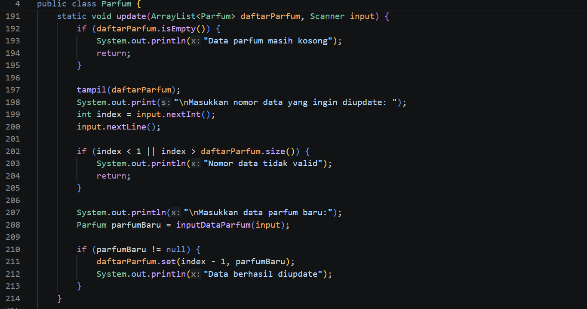

Berfungsi untuk mengubah data parfum yang sudah ada di ArrayList

Sebelum mengupdate data parfum, dia akan mengecek dulu apakah datanya kosong apa tidak, kalau kosong maka akan menampilkan pesan Data parfum masih kosong

Kalau ada isinya maka dia akan menampilkan dulu semua data parfum saat ini dengan method tampil()

Kemudian kita bisa memasukkan angka untuk memilih data parfum mana yang ingin kita update, dengan kondisi user tidak boleh memasukkan angka kurang dari 1 atau user memasukkan angka lebih besar dari jumlah data yang ada

Setelah semua kondisi terpenuhi, kita bisa memasukkan nama, jenis, harga, dan isi baru dan program akan menggantinya dengan mengimplementasikan konsep setter

Method ini bersifat private karena sser tidak berinteraksi langsung dengan method ini dari luar class

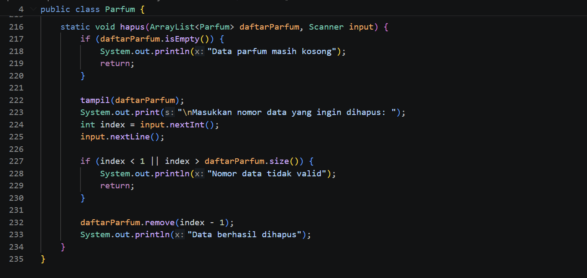

Berfungsi untuk menghapus data parfum yang sudah ada di ArrayList

Sebelum menghapus data parfum, dia akan mengecek dulu apakah datanya kosong apa tidak, kalau kosong maka akan menampilkan pesan Data parfum masih kosong

Kalau ada isinya maka dia akan menampilkan dulu semua data parfum saat ini dengan method tampil()

Kemudian kita bisa memasukkan angka untuk memilih data parfum mana yang ingin kita hapus, dengan kondisi user tidak boleh memasukkan angka kurang dari 1 atau user memasukkan angka lebih besar dari jumlah data yang ada

Setelah semua kondisi terpenuhi, maka parfum yang dipilih akan terhapus\

Method hapus cocok memakai modifier default karena hapus() tetap bisa dipakai di class yang sama atau package yang sama, tetapi tidak dibuka penuh seperti public

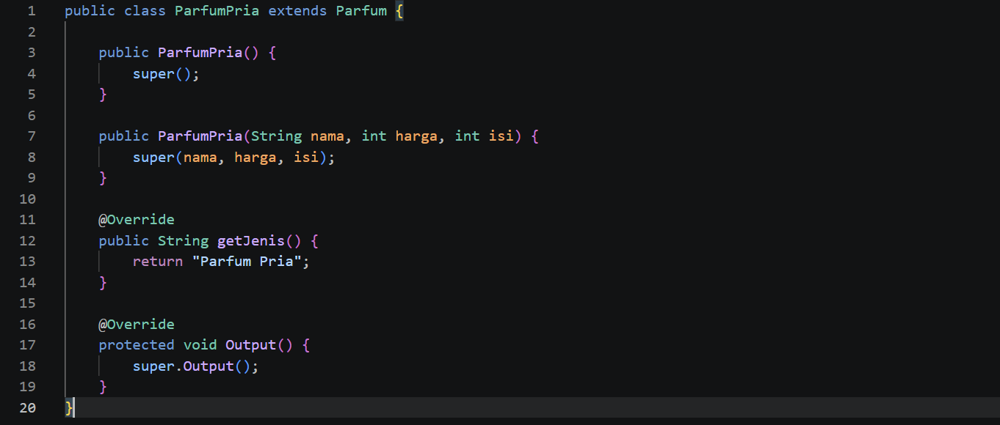

Mendefinisikan class ParfumPria sebagai turunan dari parfum menggunakan konsep inheritance yang diimplementasikan dengan extends jadi ParfumPria mewarisi semua atribut dan method yang ada di class parfum

Terdapat perilaku khusus yang dimiliki ParfumPria yaitu aromaMaskulin()

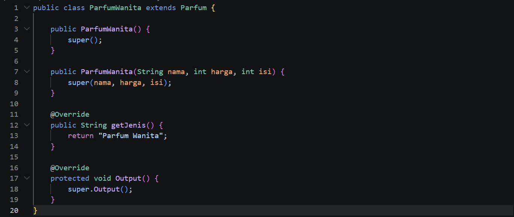

Mendefinisikan class ParfumWanita sebagai turunan dari parfum menggunakan konsep inheritance yang diimplementasikan dengan extends jadi ParfumWanita mewarisi semua atribut dan method yang ada di class parfum

Terdapat perilaku khusus yang dimiliki ParfumWanita yaitu aromaFeminin()

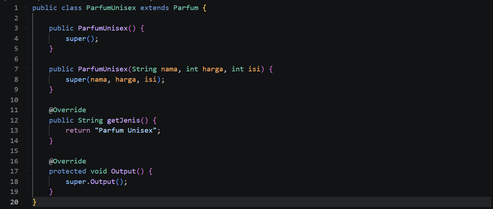

Mendefinisikan class ParfumUnisex sebagai turunan dari parfum menggunakan konsep inheritance yang diimplementasikan dengan extends jadi ParfumUnisex mewarisi semua atribut dan method yang ada di class parfum

Terdapat perilaku khusus yang dimiliki ParfumWanita yaitu aromaNetral()

2. HASIL OUTPUT

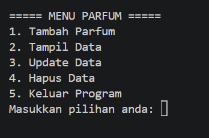

Tampilan halaman awal

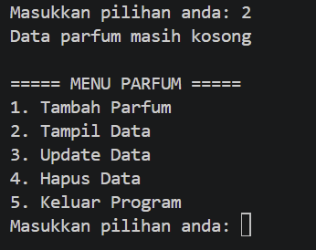

Tampilan data kosong

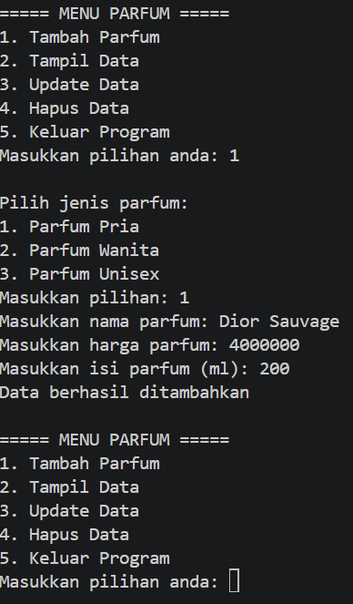

Tambah data parfum pria

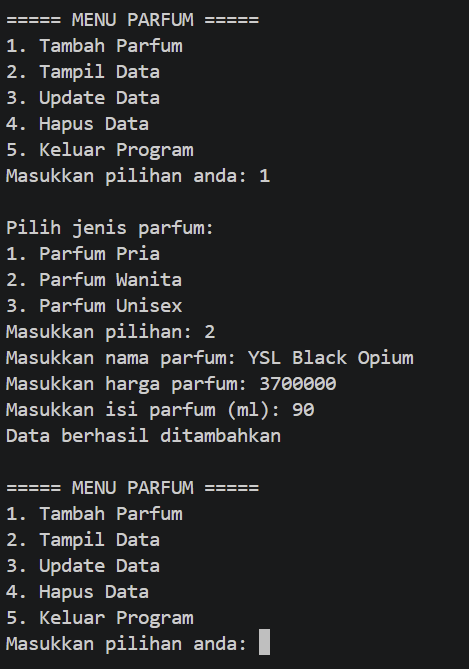

Tambah data parfum wanita

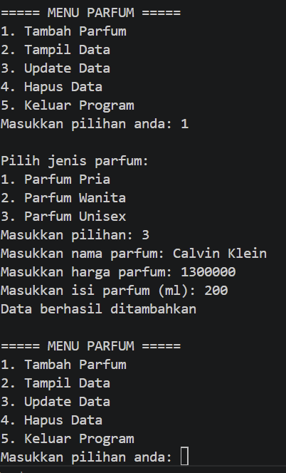

Tambah data parfum unisex

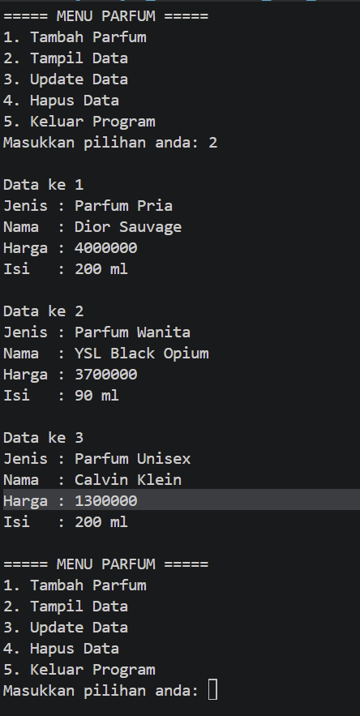

Tampilkan data

.png>)

.png>)

Update data

.png>)

Tampilkan data (updated)

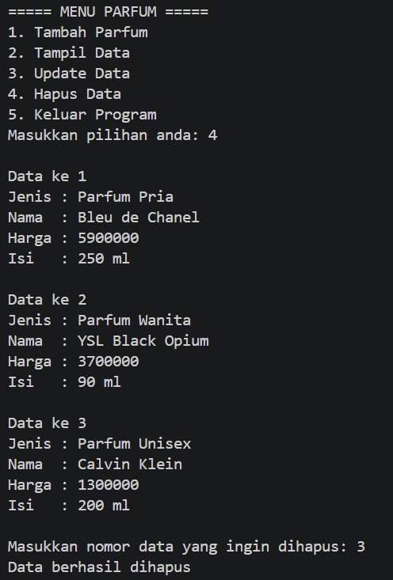

Hapus Parfum

.png>)

Tampilkan data (deleted)

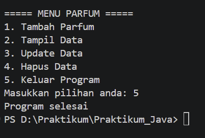
