1. PENJELASAN PROGRAM

Di bagian ini saya akan memberikan gambar dari blok blok kode yang saya pakai di program saya beserta penjelasan singkat per blok kodenya

Menggunakan package bernama parfum yang berfungsi untuk mengelompokkan class agar lebih terstruktur dan lebih rapi, terus class lain dalam package yang sama juga bisa diakses tanpa perlu import tambahan

Lalu blok kode public class App berfungsi sebagai awal program berjalan, saat program dijalankan Java akan masuk ke method main() di dalam class app, lalu memanggil Parfum.mainMenu()

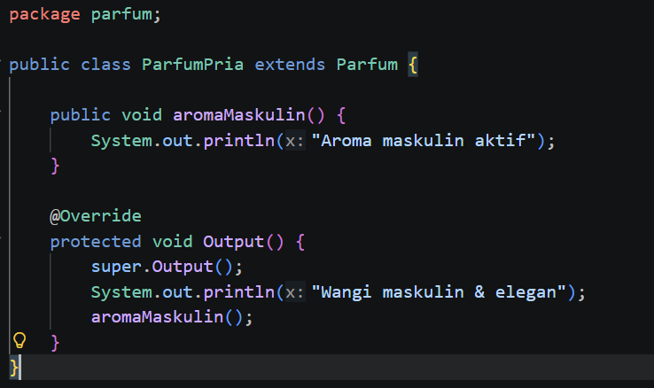

Class ParfumPria merupakan subclass dari parfum yang merepresentasikan parfum khusus untuk pria, yang mewarisi seluruh atribut dan method dari class parent

Terdapat perilaku khusus berupa method aromaMasukulin()

method Output() dioverride untuk menampilkan informasi tambahan yang membedakan parfum pria dari jenis lainnya

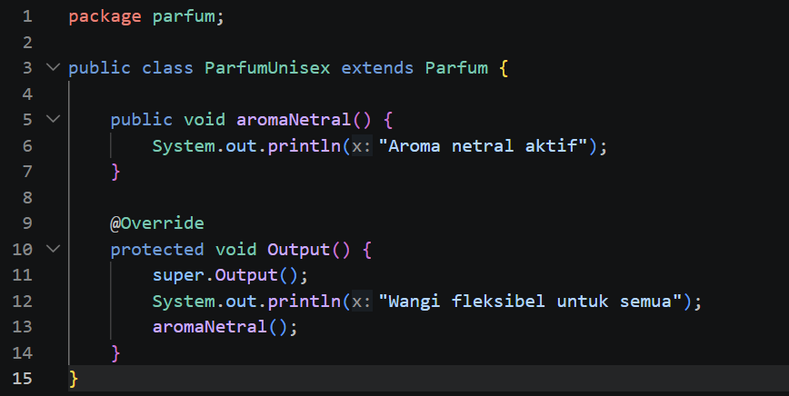

Class ParfumWanita merupakan subclass dari parfum yang merepresentasikan parfum khusus untuk wanita, yang mewarisi seluruh atribut dan method dari class parent

Terdapat perilaku khusus berupa method aromaFeminin()

method Output() dioverride untuk menampilkan informasi tambahan yang membedakan parfum wanita dari jenis lainnya

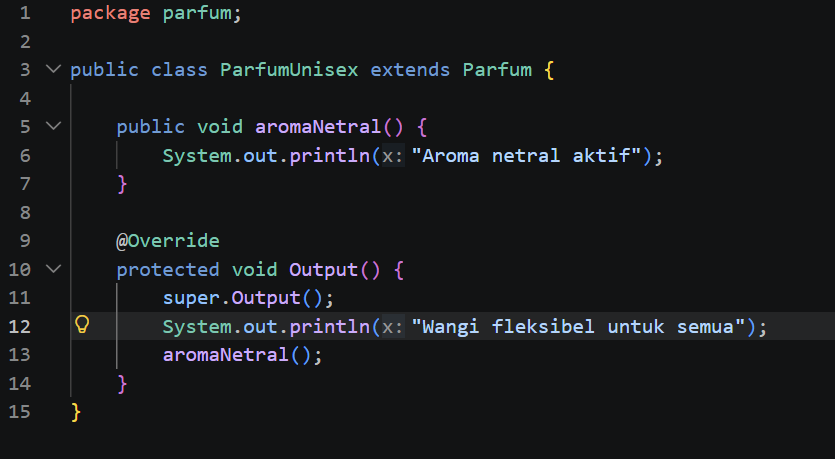

Class ParfumUnisex merupakan subclass dari parfum yang merepresentasikan parfum khusus untuk pria dan wanita, yang mewarisi seluruh atribut dan method dari class parent

Terdapat perilaku khusus berupa method aromaNetral()

method Output() dioverride untuk menampilkan informasi tambahan yang membedakan parfum unisex dari jenis lainnya

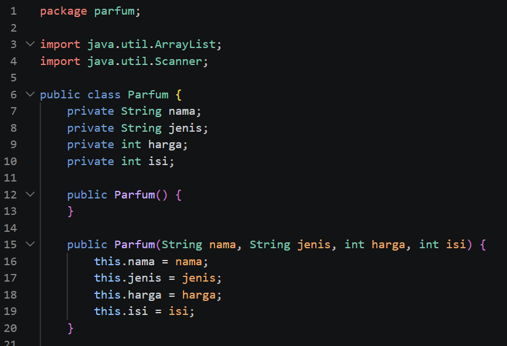

import java.util.Arraylist dan import java.util.Scanner digunakan untuk mengimport package java.util seperti arraylist, scanner, dll

Membuat class utama parfum yang bersifat public agar bisa diakses di luar kelas

Membuat class DataParfum yang berisi atribut nama, isi, jenis dan harga yang bersifat private agar tidak bisa diakses di luar kelas

Membuat constructor kosong untuk membuat objek DataParfum tanpa langsung mengisi data

Membuat constructor dengan isi dengan parameter nama, isi, jenis, dan harga yang nanti digunakan untuk langsung isi data saat membuat objek

.png>)

.png>)

Memakai method getter untuk mengambil nilai nama, isi, jenis dan harga yang semuanya bersifat public

Memakai method setter untuk untuk mengisi nilai dari nama, jenis, isi dan harga yang diisi boolean untuk mengembalikan hasil true atau false dan semuanya bersifat public

Setiap method setter memiliki kondisinya sendiri dimana untuk nama parfum tidak boleh kosong, jenis parfum tidak boleh kosong, harga parfum harus lebih dari 0, dan isi parfum harus lebih dari 0, jika kondisi terpenuhi maka akan menghasilkan nilai true

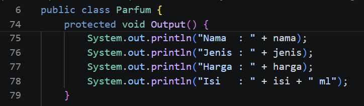

Terdapat protected void output gunanya cuma untuk menampilkan output data parfum ke layar

.png>)

.png>)

Membuat arraylist bernama daftarParfum yang fungsinya untuk menyimpan banyak data parfum

Method yang berfungsi untuk menampilkan menu utama

Dapat menyimpan angka pilihan menu dari user di variabel pilihan bertipe int, semisal user input angka 1 maka akan masuk ke case 1

Menggunakan perulangan do-while agar program terus berjalan dan halaman menu nya minimal muncul dulu sekali, program akan terus mengulang selama user tidak menginput angka 6

Jika user memilih angka 1 maka method tambah akan dijalankan

Jika user memilih angka 2 maka method tampil akan dijalankan

Jika user memilih angka 3 maka method update akan dijalankan

Jika user memilih angka 4 maka method hapus akan dijalankan

Jika user memilih angka 5 maka method tampil + (jenis) akan dijalankan

Jika user memilih angka 6 maka program akan berhenti dan menampilkan pesan Program selesai

Jika user memilih angka selain angka 1, 2, 3, 4, 5 dan 6 maka program akan menampilkan pesan Pilihan tidak valid dan akan tetap looping

.png>)

.png>)

Method tambah digunakan untuk menambah parfum baru

Method tambah() bertugas sebagai penghubung yang memanggil inputDataParfum() untuk mengambil input dari user dan membuat objek parfum baru

Method inputDataParfum() sendiri bertanggung jawab untuk menentukan jenis parfum berdasarkan input (menggunakan inheritance), lalu mengisi atribut seperti nama, harga, dan isi dengan validasi menggunakan setter

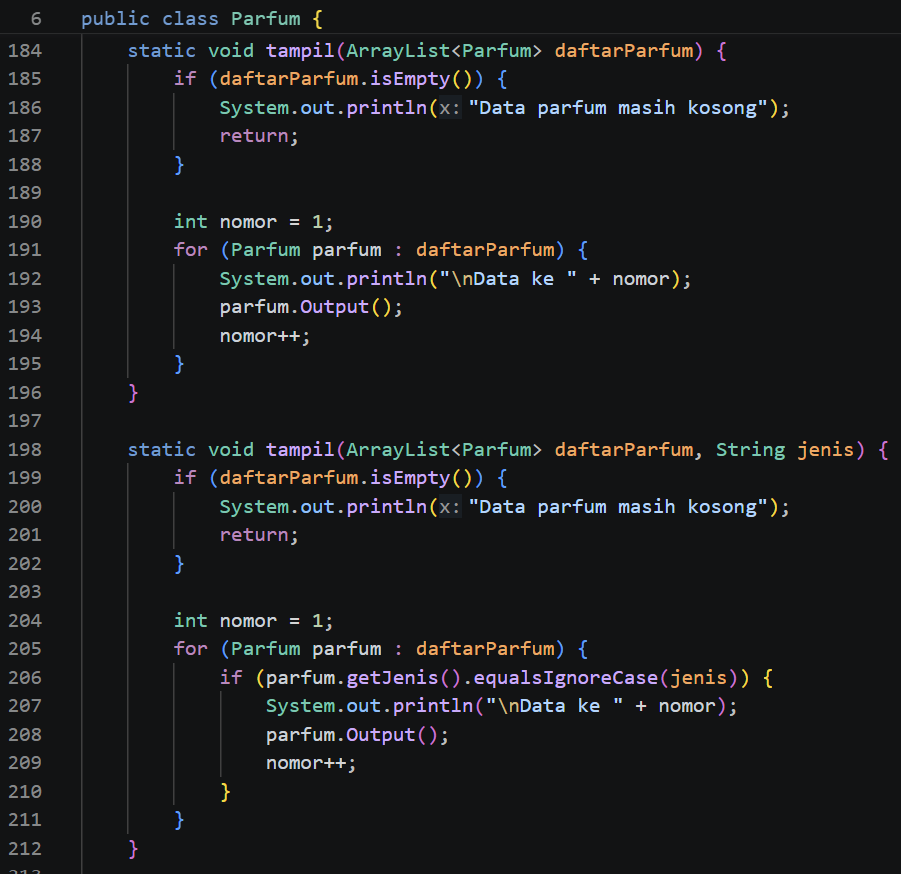

Method tampil digunakan untuk menampilkan daftar parfum saat ini

Pada blok Tampilkan data saya menerapkan konsep method overloading

Method pertama menampilkan seluruh data parfum tanpa filter, sedangkan method kedua hanya menampilkan data berdasarkan jenis tertentu (pria, wanita, atau unisex), keduanya juga menerapkan konsep polymorphism (override) saat memanggil parfum.Output()

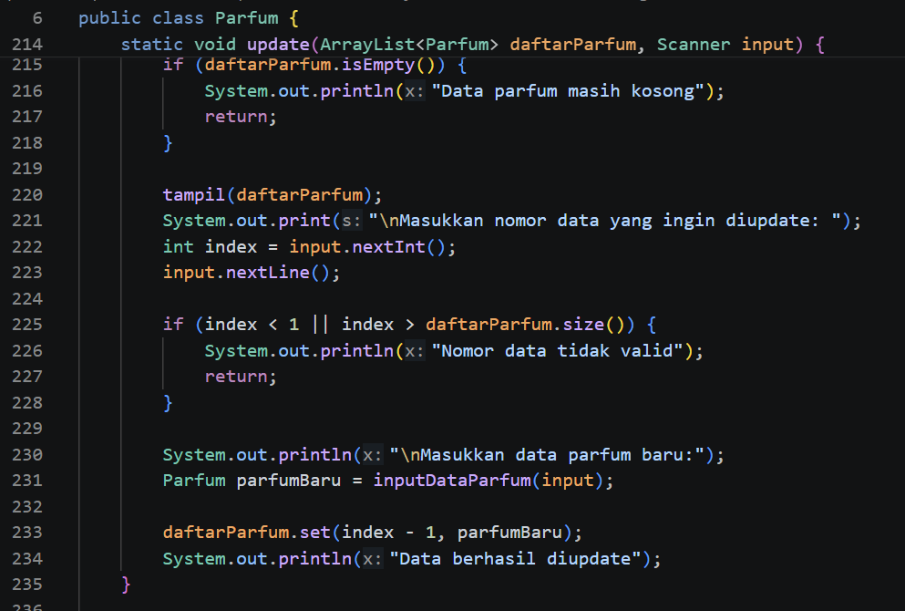

Berfungsi untuk mengubah data parfum yang sudah ada di ArrayList

Sebelum mengupdate data parfum, dia akan mengecek dulu apakah datanya kosong apa tidak, kalau kosong maka akan menampilkan pesan Data parfum masih kosong

Kalau ada isinya maka dia akan menampilkan dulu semua data parfum saat ini dengan method tampil()

Kemudian kita bisa memasukkan angka untuk memilih data parfum mana yang ingin kita update, dengan kondisi user tidak boleh memasukkan angka kurang dari 1 atau user memasukkan angka lebih besar dari jumlah data yang ada

Setelah semua kondisi terpenuhi, kita bisa memasukkan nama, jenis, harga, dan isi baru dan program akan menggantinya dengan mengimplementasikan konsep setter

Method ini bersifat private karena sser tidak berinteraksi langsung dengan method ini dari luar class

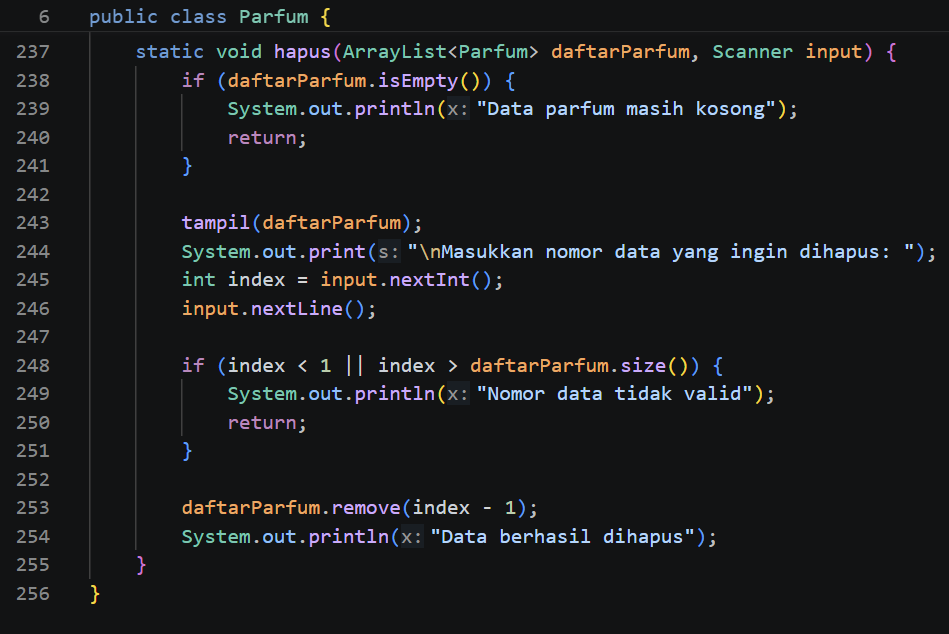

Berfungsi untuk menghapus data parfum yang sudah ada di ArrayList

Sebelum menghapus data parfum, dia akan mengecek dulu apakah datanya kosong apa tidak, kalau kosong maka akan menampilkan pesan Data parfum masih kosong

Kalau ada isinya maka dia akan menampilkan dulu semua data parfum saat ini dengan method tampil()

Kemudian kita bisa memasukkan angka untuk memilih data parfum mana yang ingin kita hapus, dengan kondisi user tidak boleh memasukkan angka kurang dari 1 atau user memasukkan angka lebih besar dari jumlah data yang ada

Setelah semua kondisi terpenuhi, maka parfum yang dipilih akan terhapus\

Method hapus cocok memakai modifier default karena hapus() tetap bisa dipakai di class yang sama atau package yang sama, tetapi tidak dibuka penuh seperti public

2. HASIL OUTPUT

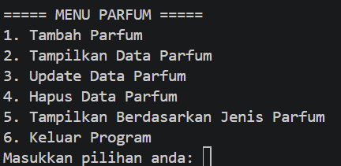

Tampilan halaman awal

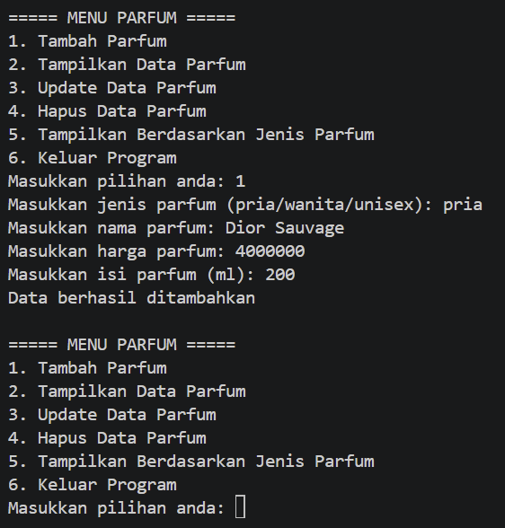

Tambah data parfum pria

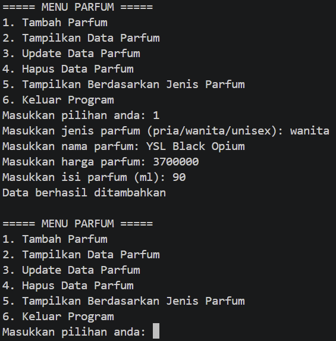

Tambah data parfum wanita

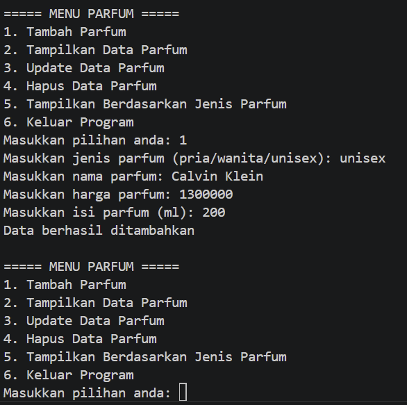

Tambah data parfum unisex

.png>)

.png>)

Update data

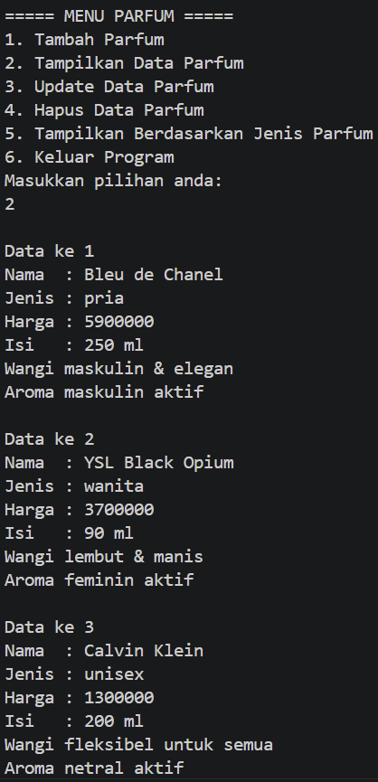

Tampilkan data (updated)

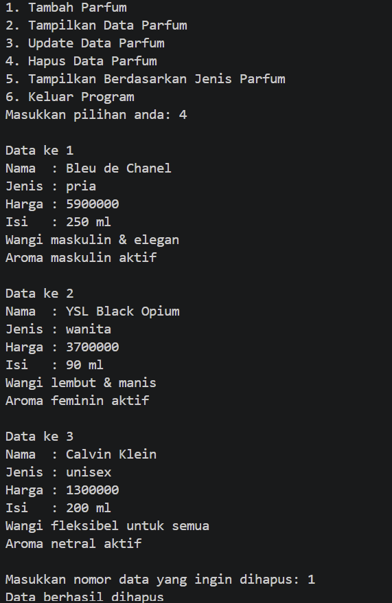

Hapus Parfum

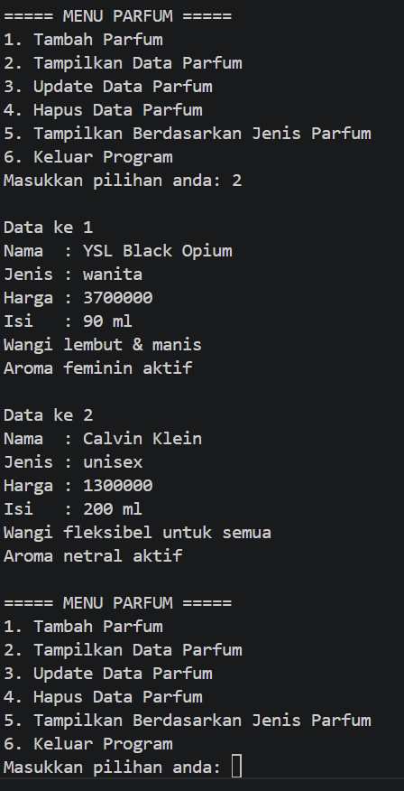

Tampilkan data (deleted)

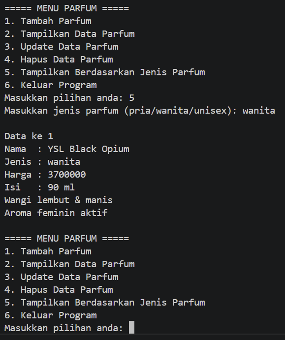

Tampilkan data bersadarkan jenis

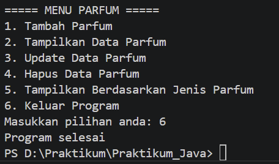

Keluar Program
