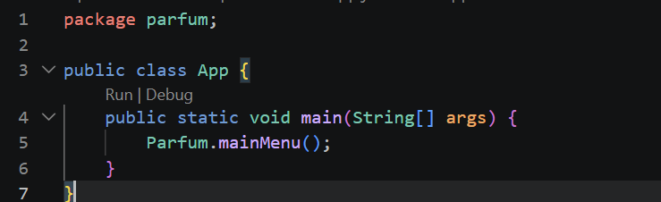
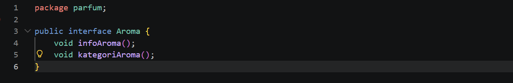
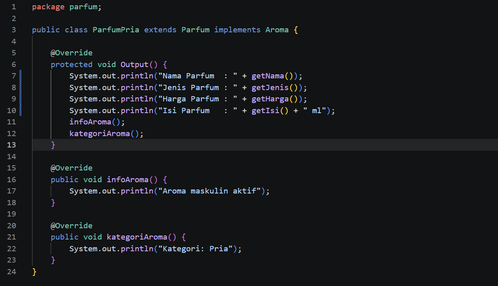
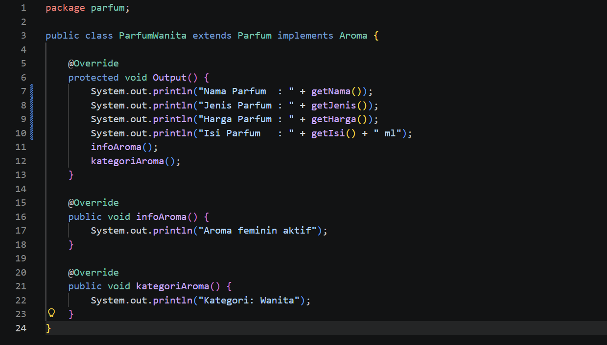
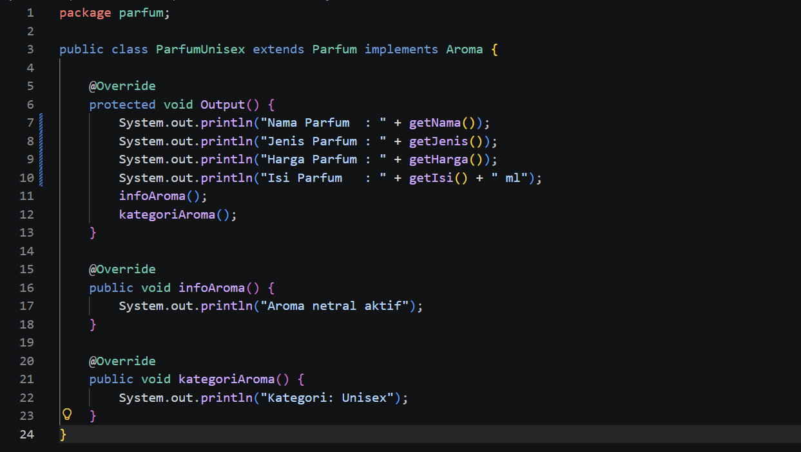
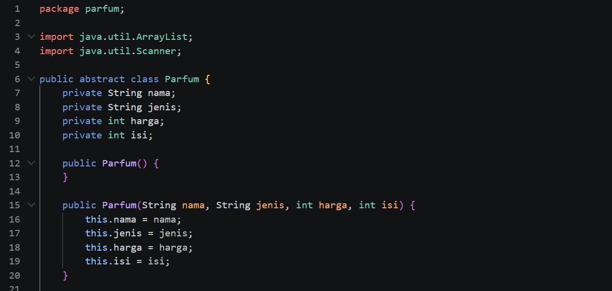
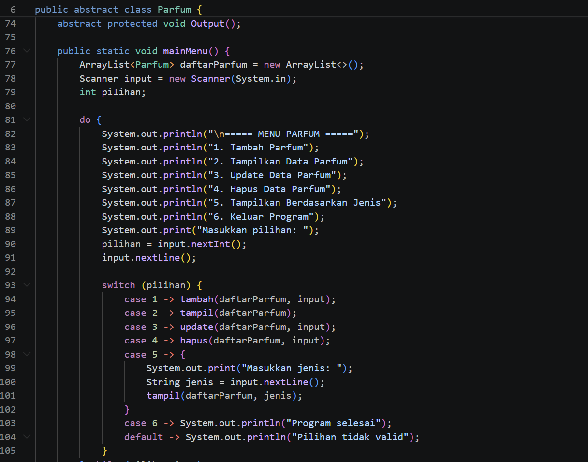
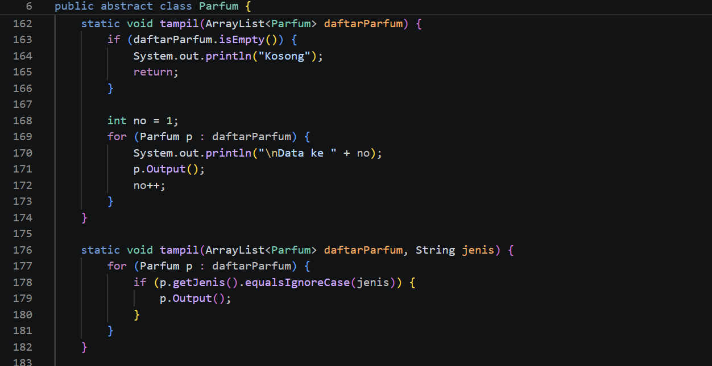
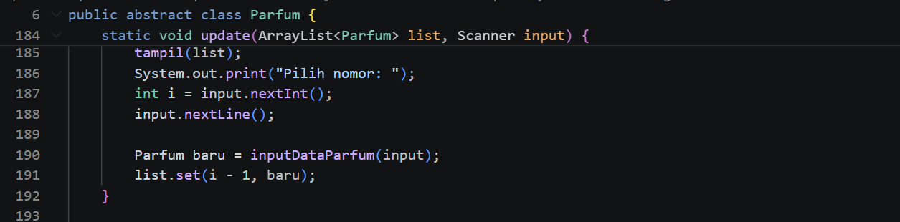
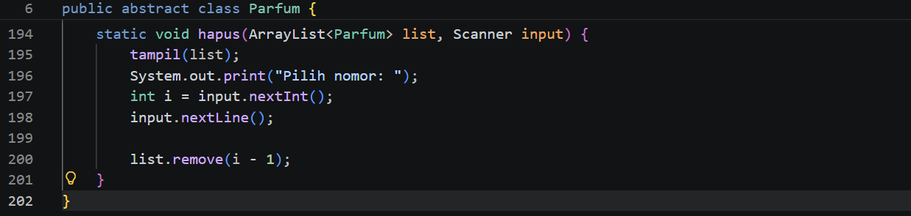

1. PENJELASAN PROGRAM

Di bagian ini saya akan memberikan gambar dari blok blok kode yang saya pakai di program saya beserta penjelasan singkat per blok kodenya

Menggunakan package bernama parfum yang berfungsi untuk mengelompokkan class agar lebih terstruktur dan lebih rapi, terus class lain dalam package yang sama juga bisa diakses tanpa perlu import tambahan

Lalu blok kode public class App berfungsi sebagai awal program berjalan, saat program dijalankan Java akan masuk ke method main() di dalam class app, lalu memanggil Parfum.mainMenu()

nterface Aroma digunakan sebagai kontrak yang harus diimplementasikan oleh class lain seperti ParfumPria, ParfumWanita, dan ParfumUnisex

Interface ini memiliki dua method yaitu infoAroma() dan kategoriAroma() yang tidak memiliki isi (abstract secara otomatis), sehingga setiap class yang mengimplementasikan interface ini wajib mendefinisikan kedua method tersebut

Class ParfumPria merupakan subclass dari Parfum yang merepresentasikan parfum khusus pria serta mengimplementasikan interface Aroma, sehingga mewarisi atribut dan method dari parent sekaligus wajib memiliki method infoAroma() dan kategoriAroma()

Perilaku khusus ditunjukkan melalui method infoAroma() dan kategoriAroma() yang menampilkan ciri khas parfum pria

Method Output() dioverride untuk menampilkan data parfum sekaligus menambahkan informasi aroma dan kategori yang membedakan parfum pria dari jenis lainnya

Class ParfumWanita merupakan subclass dari Parfum yang merepresentasikan parfum khusus wanita serta mengimplementasikan interface Aroma, sehingga mewarisi atribut dan method dari parent sekaligus wajib memiliki method infoAroma() dan kategoriAroma()

Perilaku khusus ditunjukkan melalui method infoAroma() dan kategoriAroma() yang menampilkan ciri khas parfum wanita

Method Output() dioverride untuk menampilkan data parfum sekaligus menambahkan informasi aroma dan kategori yang membedakan parfum wanita dari jenis lainnya

Class ParfumUnisex merupakan subclass dari Parfum yang merepresentasikan parfum khusus unisex serta mengimplementasikan interface Aroma, sehingga mewarisi atribut dan method dari parent sekaligus wajib memiliki method infoAroma() dan kategoriAroma().

Perilaku khusus ditunjukkan melalui method infoAroma() dan kategoriAroma() yang menampilkan ciri khas parfum unisex

Method Output() dioverride untuk menampilkan data parfum sekaligus menambahkan informasi aroma dan kategori yang membedakan parfum unisex dari jenis lainnya

import java.util.ArrayList dan import java.util.Scanner digunakan untuk mengakses class bawaan Java seperti ArrayList untuk menyimpan data dan Scanner untuk input dari user

Membuat class utama Parfum yang bersifat public dan abstract, sehingga bisa digunakan oleh class lain tetapi tidak bisa dibuat objek secara langsung

Class Parfum memiliki atribut nama, jenis, harga, dan isi yang bersifat private sebagai bentuk encapsulation agar tidak bisa diakses langsung dari luar class

Membuat constructor kosong untuk memungkinkan pembuatan objek subclass tanpa harus langsung mengisi data

Membuat constructor dengan parameter nama, jenis, harga, dan isi yang digunakan untuk menginisialisasi atribut saat objek dibuat

.png>)

.png>)

Menggunakan method getter (getNama(), getJenis(), getHarga(), getIsi()) untuk mengambil nilai dari atribut yang bersifat private sehingga tetap menjaga encapsulation

Menggunakan method setter (setNama(), setJenis(), setHarga(), setIsi()) untuk mengisi nilai atribut dengan tipe boolean sebagai nilai kembalian (true jika berhasil, false jika gagal), dan semua method bersifat public

Setiap setter memiliki validasi: nama dan jenis tidak boleh kosong, harga harus lebih dari 0, dan isi harus lebih dari 0 ml. Jika input sesuai kondisi maka data akan disimpan dan method mengembalikan true, jika tidak maka akan menampilkan pesan error dan mengembalikan false

Method abstract protected void Output() merupakan method abstrak yang tidak memiliki isi di class Parfum dan wajib diimplementasikan oleh subclass seperti ParfumPria, ParfumWanita, dan ParfumUnisex

Membuat ArrayList bernama daftarParfum yang berfungsi untuk menyimpan banyak data objek parfum

Method mainMenu() digunakan untuk menampilkan menu utama program dan mengatur alur jalannya program

Data pilihan menu dari user disimpan dalam variabel pilihan bertipe int, yang nantinya digunakan dalam percabangan switch

Menggunakan perulangan do-while agar program terus berjalan dan menu minimal tampil sekali, serta akan terus mengulang selama user tidak memilih angka 6

Jika user memilih angka 1 maka method tambah() akan dijalankan untuk menambahkan data parfum

Jika user memilih angka 2 maka method tampil() akan dijalankan untuk menampilkan semua data parfum

Jika user memilih angka 3 maka method update() akan dijalankan untuk mengubah data parfum

Jika user memilih angka 4 maka method hapus() akan dijalankan untuk menghapus data parfum

Jika user memilih angka 5 maka method tampil(daftarParfum, jenis) akan dijalankan untuk menampilkan data berdasarkan jenis parfum

Jika user memilih angka 6 maka program akan berhenti dan menampilkan pesan program selesai

Jika user memilih selain angka 1–6 maka program akan menampilkan pesan “Pilihan tidak valid” dan tetap kembali ke menu

.png>)

.png>)

Method tambah() digunakan untuk menambahkan data parfum baru ke dalam ArrayList daftarParfum. Method ini berfungsi sebagai penghubung yang memanggil inputDataParfum() untuk mengambil input dari user dan membuat objek parfum, kemudian menambahkannya ke dalam list jika tidak bernilai null

Method inputDataParfum() bertanggung jawab untuk membuat objek parfum berdasarkan jenis yang diinput user menggunakan konsep inheritance (ParfumPria, ParfumWanita, ParfumUnisex). Jika jenis tidak valid maka method akan mengembalikan null

Setelah objek dibuat, atribut seperti jenis, nama, harga, dan isi diisi menggunakan method setter yang memiliki validasi. Proses input dilakukan dengan perulangan while agar user diminta menginput ulang jika data tidak valid, sampai memenuhi kondisi yang ditentukan

Setelah semua data valid dan berhasil diisi, method akan mengembalikan objek parfum yang kemudian ditambahkan ke dalam ArrayList

Method tampil() digunakan untuk menampilkan data parfum yang tersimpan di dalam ArrayList

Pada bagian ini diterapkan konsep method overloading, yaitu terdapat dua method dengan nama yang sama tetapi parameter berbeda. Method pertama menampilkan seluruh data parfum dan akan mengecek terlebih dahulu apakah data kosong, sedangkan method kedua digunakan untuk menampilkan data berdasarkan jenis tertentu (pria, wanita, atau unisex)

Perulangan for-each digunakan untuk menampilkan setiap objek parfum, dan pemanggilan p.Output() menerapkan konsep polymorphism (override) karena method yang dijalankan akan menyesuaikan dengan jenis objeknya (ParfumPria, ParfumWanita, atau ParfumUnisex)

Method update() digunakan untuk mengubah data parfum yang sudah ada di dalam ArrayList

Method ini akan menampilkan terlebih dahulu seluruh data parfum menggunakan method tampil(), kemudian user diminta memilih nomor data yang ingin diupdate

Setelah itu, program akan memanggil inputDataParfum() untuk memasukkan data parfum baru (nama, jenis, harga, dan isi) dengan validasi menggunakan setter

Data lama kemudian digantikan dengan data baru menggunakan list.set(i - 1, baru)

Method ini bersifat static (bukan private), karena digunakan di dalam class yang sama dan dipanggil melalui menu utama

Method hapus() digunakan untuk menghapus data parfum yang ada di dalam ArrayList.

Method ini akan menampilkan terlebih dahulu seluruh data parfum menggunakan method tampil(), kemudian user diminta memilih nomor data yang ingin dihapus.

Setelah user memasukkan nomor, data parfum yang dipilih akan dihapus menggunakan list.remove(i - 1).

Method ini bersifat static dengan modifier default (tanpa public/private), sehingga dapat digunakan dalam class atau package yang sama.

2. HASIL OUTPUT

Tampilan halaman awal

Tambah data parfum pria

Tambah data parfum wanita

Tambah data parfum unisex

Menampilkan parfum yang telah ditambahkan

Update data

.png>)

Tampilkan data (updated)

Hapus Parfum

.png>)

Tampilkan data (deleted)

Tampilkan data bersadarkan jenis

Keluar Program
